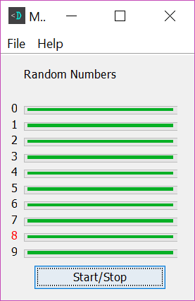

MindSkew
==================

Can you mind affect random numbers generated by a computer?
Run this program, focus on a single number, and see if you can
get the machine to pick more of that number.

Source Code
-----------
* [MindSkew (GitHub.com)](https://www.github.com/DevDungeon/MindSkew)

Running
-------
* Run MainWindow.java

Contact
-------
NanoDano <nanodano@devdungeon.com>

License
-------
GNU General Public License, version 2 (See LICENSE.txt)

Changelog
---------
v1.0 - 2018/9/24 - Initial stable release.

To do
-----
* Provide better feedback and instructions to the user
* Tweak how long it runs
* Create other modes: heads/tails, image decoding, orderliness measurement
